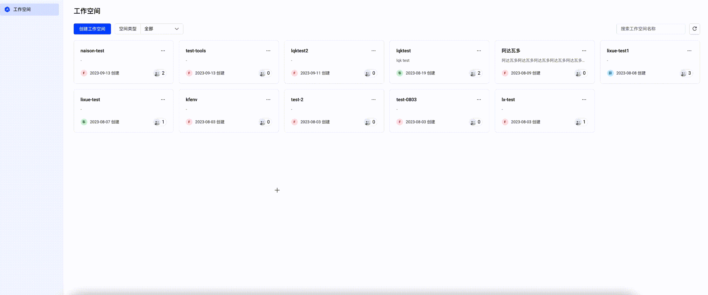

# 协同编辑

# 引言

## 背景

需要开发一个协同实训平台，依赖于一个协同 CloudIDE。

## 目标

## 基础能力

支持部分常用代码的语法渲染，包括bash, python。支持图片文件（后缀为bmp、jpg、jpeg、png、gif、svg）的预览，等比充满，居中展示（不需要支持放大缩小和移动）

## 高级能力

- 用户能互相看到其他协作者在文本内的编辑位置。
- 用户自己在当前设备上的光标为黑色；其他协作者（包括在其他设备上在线的自己）的光标颜色与其头像的角标颜色一致，且只要光标移动就会展示用户名，光标停留3s后隐藏。

## 需求分析

[协同编辑](https://objcer.com/2018/03/05/SharePen-Operational-Transformation/)

[OT演示](https://operational-transformation.github.io/index.html)

# 技术设计

## 操作转换(transform)

OT 算法的核心就是这个 transform 转换算法，OT 的思路是将编辑转换成操作 (operation)，当多人协同操作时，就需要对这些操作进行转换，使得最终文档的内容一致。


如上图左，a 表示用户 A 的 operation，b 表示用户 B 的 operation，二者相交的顶点表示文档状态相同，此时用户 A 和用户 B
对文档分别应用操作 a 和 b，这时两边的文档内容都发生变化，且不一致；为了用户 A 和用户 B 的文档达到一致的状态，我们需要对 a
和 b 进行操作转换 transfrom(a, b) => (a', b') 得到两个衍生的操作 a' 和 b'。

如上图右，a' 在用户 B 应用，b' 在用户 A 应用，最终文档内容达到一致。
例如：

- 用户 A：[0, a]
- 用户 B：[0, b]

服务端会根据收到的顺序，确定最终的状态。比如用户 A 的操作先到达。 则内容为：ab。 此时:

- 用户 A 会收到：[1, b] 和 [0, a]
- 用户 B 会收到：[0, a] 和 [1, b]

## 操作合并(compose)

### 合并与自己修改 - compose

例如：小王输入 [2,a]，在等待a的确认之前，后续的输入是要暂存的，[3,b] 和 [4,c] 会被compose成[3, bc]，等a回执确认后一起发送出去。

### 合并与他人修改 - transform

与服务端区别：服务端和客户端的 transform 主要逻辑是相似的，不同之处在于，服务端会以 rev 为基准进行 transform
操作，而客户端会以服务端为基准，做 transform 操作。

例如：小王输入 [2,a]，此时另外一名队友小刘也在同一个位置输入 [2,b]，并且先到服务端，小王在发送 [2,a]
前，收到了服务端对小刘更改的推送，此时小刘的 [2,b] 和小王的 [2,a] 会做一个transform，最终小王发送的是？[3,a]

## 架构设计


## 详细设计

```go
package ot

import (
	"encoding/json"
	"strings"
	"unicode/utf16"
)

// Op represents a single operation.
type Op struct {
	// N signifies the operation type:
	// >  0: Retain  N bytes
	// <  0: Delete -N bytes
	// == 0: Noop or Insert string S
	N int
	S string
}

// Ops represents a sequence of operations.
type Ops []Op

// Count returns the number of retained, deleted and inserted bytes.
func (ops Ops) Count() (ret, del, ins int) {
	for _, op := range ops {
		switch {
		case op.N > 0:
			ret += op.N
		case op.N < 0:
			del += -op.N
		case op.N == 0:
			ins += utf16Length(op.S)
		}
	}
	return
}

func utf16Length(s string) int {
	return len(utf16.Encode([]rune(s)))
}

// Merge attempts to merge consecutive operations in place and returns the sequence.
func Merge(ops Ops) Ops {
	o, l := -1, len(ops)
	for _, op := range ops {
		if op == noop {
			l--
			continue
		}
		var last Op
		if o > -1 {
			last = ops[o]
		}
		switch {
		case last.S != "" && op.N == 0:
			op.S = last.S + op.S
			l--
		case last.N < 0 && op.N < 0, last.N > 0 && op.N > 0:
			op.N += last.N
			l--
		default:
			o += 1
		}
		ops[o] = op
	}
	return ops[:l]
}

// getop returns the current sequence count and the next valid operation in ops or noop.
func getop(i int, ops Ops) (int, Op) {
	for ; i < len(ops); i++ {
		op := ops[i]
		if op != noop {
			return i + 1, op
		}
	}
	return i, noop
}

// sign return the sign of n.
func sign(n int) int {
	switch {
	case n < 0:
		return -1
	case n > 0:
		return 1
	}
	return 0
}

// Compose returns an operation sequence composed from the consecutive ops a and b.
// An error is returned if the composition failed.
func Compose(a, b Ops) (ab Ops, err error) {
	if len(a) == 0 || len(b) == 0 {
		return
	}
	reta, _, ins := a.Count()
	retb, del, _ := b.Count()
	if reta+ins != retb+del {
		err = apperrors.ComposeInconsecutiveOps_IDE().ToCommonError()
		return
	}
	ia, oa := getop(0, a)
	ib, ob := getop(0, b)
	for oa != noop || ob != noop {
		if oa.N < 0 { // delete a
			ab = append(ab, oa)
			ia, oa = getop(ia, a)
			continue
		}
		if ob.N == 0 && ob.S != "" { // insert b
			ab = append(ab, ob)
			ib, ob = getop(ib, b)
			continue
		}
		if oa == noop || ob == noop {
			err = apperrors.ComposeShortOps_IDE().ToCommonError()
			return
		}
		switch {
		case oa.N > 0 && ob.N > 0: // both retain
			switch sign(oa.N - ob.N) {
			case 1:
				oa.N -= ob.N
				ab = append(ab, ob)
				ib, ob = getop(ib, b)
			case -1:
				ob.N -= oa.N
				ab = append(ab, oa)
				ia, oa = getop(ia, a)
			default:
				ab = append(ab, oa)
				ia, oa = getop(ia, a)
				ib, ob = getop(ib, b)
			}
		case oa.N == 0 && ob.N < 0: // insert delete
			switch sign(utf16Length(oa.S) + ob.N) {
			case 1:
				oa = Op{S: ToString(oa.S, -ob.N, utf16Length(oa.S))}
				ib, ob = getop(ib, b)
			case -1:
				ob.N += utf16Length(oa.S)
				ia, oa = getop(ia, a)
			default:
				ia, oa = getop(ia, a)
				ib, ob = getop(ib, b)
			}
		case oa.N == 0 && ob.N > 0: // insert retain
			switch sign(utf16Length(oa.S) - ob.N) {
			case 1:
				ab = append(ab, Op{S: ToString(oa.S, 0, ob.N)})
				oa = Op{S: ToString(oa.S, ob.N, utf16Length(oa.S))}
				ib, ob = getop(ib, b)
			case -1:
				ob.N -= utf16Length(oa.S)
				ab = append(ab, oa)
				ia, oa = getop(ia, a)
			default:
				ab = append(ab, oa)
				ia, oa = getop(ia, a)
				ib, ob = getop(ib, b)
			}
		case oa.N > 0 && ob.N < 0: // retain delete
			switch sign(oa.N + ob.N) {
			case 1:
				oa.N += ob.N
				ab = append(ab, ob)
				ib, ob = getop(ib, b)
			case -1:
				ob.N += oa.N
				oa.N *= -1
				ab = append(ab, oa)
				ia, oa = getop(ia, a)
			default:
				ab = append(ab, ob)
				ia, oa = getop(ia, a)
				ib, ob = getop(ib, b)
			}
		default:
			panic("This should never have happened.")
		}
	}
	ab = Merge(ab)
	return
}

// Transform returns two operation sequences derived from the concurrent ops a and b.
// An error is returned if the transformation failed.
func Transform(a, b Ops) (a1, b1 Ops, err error) {
	if a == nil || b == nil {
		return
	}
	reta, dela, _ := a.Count()
	retb, delb, _ := b.Count()
	if reta+dela != retb+delb {
		err = apperrors.TransformNotConcurrentOps_IDE().ToCommonError()
		return
	}
	ia, oa := getop(0, a)
	ib, ob := getop(0, b)
	for oa != noop || ob != noop {
		var om Op
		if oa.N == 0 && oa.S != "" { // insert a
			om.N = utf16Length(oa.S)
			a1 = append(a1, oa)
			b1 = append(b1, om)
			ia, oa = getop(ia, a)
			continue
		}
		if ob.N == 0 && ob.S != "" { // insert b
			om.N = utf16Length(ob.S)
			a1 = append(a1, om)
			b1 = append(b1, ob)
			ib, ob = getop(ib, b)
			continue
		}
		if oa == noop || ob == noop {
			err = apperrors.TransformShortOps_IDE().ToCommonError()
			return
		}
		switch {
		case oa.N > 0 && ob.N > 0: // both retain
			switch sign(oa.N - ob.N) {
			case 1:
				om.N = ob.N
				oa.N -= ob.N
				ib, ob = getop(ib, b)
			case -1:
				om.N = oa.N
				ob.N -= oa.N
				ia, oa = getop(ia, a)
			default:
				om.N = oa.N
				ia, oa = getop(ia, a)
				ib, ob = getop(ib, b)
			}
			a1 = append(a1, om)
			b1 = append(b1, om)
		case oa.N < 0 && ob.N < 0: // both delete
			switch sign(-oa.N + ob.N) {
			case 1:
				oa.N -= ob.N
				ib, ob = getop(ib, b)
			case -1:
				ob.N -= oa.N
				ia, oa = getop(ia, a)
			default:
				ia, oa = getop(ia, a)
				ib, ob = getop(ib, b)
			}
		case oa.N < 0 && ob.N > 0: // delete, retain
			switch sign(-oa.N - ob.N) {
			case 1:
				om.N = -ob.N
				oa.N += ob.N
				ib, ob = getop(ib, b)
			case -1:
				om.N = oa.N
				ob.N += oa.N
				ia, oa = getop(ia, a)
			default:
				om.N = oa.N
				ia, oa = getop(ia, a)
				ib, ob = getop(ib, b)
			}
			a1 = append(a1, om)
		case oa.N > 0 && ob.N < 0: // retain, delete
			switch sign(oa.N + ob.N) {
			case 1:
				om.N = ob.N
				oa.N += ob.N
				ib, ob = getop(ib, b)
			case -1:
				om.N = -oa.N
				ob.N += oa.N
				ia, oa = getop(ia, a)
			default:
				om.N = -oa.N
				ia, oa = getop(ia, a)
				ib, ob = getop(ib, b)
			}
			b1 = append(b1, om)
		default:
			err = apperrors.TransformIncompatibleOps_IDE().ToCommonError()
			return
		}
	}
	a1, b1 = Merge(a1), Merge(b1)
	return
}

// ToString convert utf8 string into utf16 and substring, convert to utf8 string
func ToString(str string, i, j int) string {
	s16 := utf16.Encode([]rune(str))
	s8 := utf16.Decode(s16[i:j])
	return string(s8)
}
```

## 效果演示

